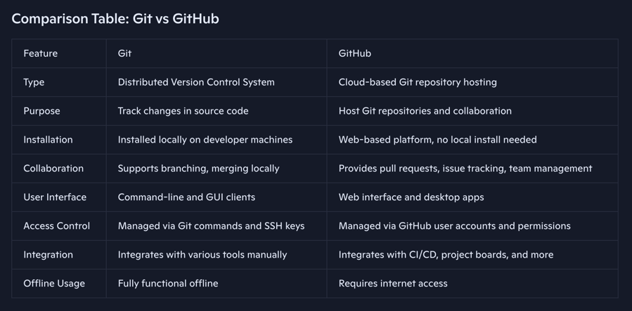

### ⛵ What is Git & GitHub
Git is a free, open source, and distributed version control system widely used in software development and DevOps to track changes in source code during software development. GitHub is a cloud-based platform that hosts Git repositories and provides collaboration features such as pull requests, issue tracking, and continuous integration. It is faster than any other tools offers better safeguards against data corruption.

### ⛵ What is a Version Control System (VCS)?
A Version Control System (VCS) is a software tool that helps developers manage changes to source code over time. It keeps track of every modification made to the codebase, allowing multiple people to collaborate, revert to previous versions, and maintain a history of changes. It is popularly know as Source Code Management (SCM).

### Types of Version Control Systems
There are mainly three types of version control systems:

#### Local Version Control Systems:
- These systems keep versions of files on the local machine. 
- They are simple but lack collaboration features.
- An example is RCS (Revision Control System).

#### Centralized Version Control Systems (CVCS):
- These systems have a single central server that stores all versions of the code.
- Developers check out files from this central place.
- Examples include CVS, Subversion (SVN), and Perforce. 
- While it allows collaboration, it has a single point of failure.

#### Distributed Version Control Systems (DVCS):
- Every developer has a full copy of the entire repository, including its history. 
- This allows for offline work and better collaboration. 
- Examples include Git, Mercurial, and Bazaar.

### ⛵ History of Git

Source Code Control System (SCCM) first built by AT&T in 1972 and shipped with Unix for free. Revision Control System (RCS) was cross-platform and faster built by Walter in 1982. Both SCCM and RCS were designed to track individual files only.

Concurrent Versions System (CVS) was built by Dick Grune to track multiple files, shared repositories in 1986. Apache Subversion (SVN) was built in 2000 which was faster used to track non-text files and track edits in a project.

Git was created by Linus Torvalds in 2005 to support the development of the Linux kernel. Before Git, the Linux kernel project used a proprietary system called BitKeeper, but due to licensing issues, Linus decided to develop a new system that was fast, distributed, and reliable.

Git quickly became popular due to its speed, flexibility, and powerful branching and merging capabilities. It is now the most widely used version control system in the world, especially in open-source and DevOps communities.

GitHub, launched in 2008, is a web-based platform that hosts Git repositories and adds collaboration features like pull requests, issue tracking, and project management, making Git even more accessible and powerful for teams.

### ⛵ What is GitHub
GitHub is a cloud-based platform that hosts Git repositories and provides a web interface for version control and collaboration. It offers features like pull requests, issue tracking, code review, and project management, making it easier for teams to work together on software projects.

Git is the underlying version control system that manages changes to files and tracks history locally and remotely. GitHub uses Git as its core technology but adds a collaborative layer on top.



### ⛵ How to install Git
Installing Git depends on your operating system. Here are the general steps for the most common platforms:
- Go to the official Git website: https://git-scm.com/download

`git --version` ⌘ Check installed version of git

### ⛵  What is a Git Repository
A Git repository (or repo) is a folder based storage space where your project files and their complete history of changes are stored using Git. It contains all the files, folders, and metadata that Git needs to track the versions of your project.

#### There are two main types of Git repositories:

1. **Local Repository:** The copy of the repository on your local machine where you make changes, commit, and manage your code.

2. **Remote Repository:** A version of the repository hosted on a server (like GitHub, GitLab, or Bitbucket) that allows collaboration and sharing with others.

Git repositories enable you to track changes, revert to previous versions, branch out for new features, and collaborate efficiently with others. Once in a lifetime of a project.

Git repository also keeps a `.git` hidden directory which contains all the information about git repository including git objects, info, logs, tags, refs etc. By default, it creates `master` branch but can be customized to create any other branch like `main`.

**Note:** Do not initialize a Git repository inside another Git repository. Avoid nesting of repositories.

### ⛵ Git Scope
Git has three main configuration scopes: system, global, and local. Each defines where settings are stored and how widely they apply. There’s also a worktree scope in newer Git versions.

#### System Scope (--system)
- Applies to: All users on the machine 
- Config file location: /etc/gitconfig (Linux/macOS) or C:\ProgramData\Git\config (Windows)
- Use case: Organization-wide defaults, like proxy settings or default line endings
```git config --system```

#### Global Scope (--global)
- Applies to: The current user across all repositories
- Config file location: ~/.gitconfig or ~/.config/git/config
- Use case: Personal identity (name, email), editor preference, aliases
```git config --global```

#### Local Scope (--local)
- Applies to: A single repository only 
- Config file location: .git/config inside the repo 
- Use case: Project-specific settings, like remotes, branch behaviors, or hooks 
```git config --local```

#### Worktree Scope (--worktree) (optional, newer Git versions)
- Applies to: A single linked worktree within a repository 
- Config file location: .git/worktrees/<name>/config 
- Use case: Different settings for multiple working directories tied to the same repo
```git config --worktree```

🔖 **Precedence Order**
- When Git looks up a configuration value, it checks in this order (from lowest to the highest priority): worktree --> local --> global --> system 
- If the same setting exists in multiple scopes, the closest scope wins (e.g. local overrides global).

### ⛵ Git Configurational Commands
Git configuration commands allow you to set up and customize Git behavior for your user account, repository, or system. These commands help define your identity, preferences, and how Git operates.


```git config --global user.name "<Firstname Lastname>"``` ✅ Configure username

```git config --global user.email "<example@email.com>"``` ✅ Configure user email

```git config --global color.ui true``` ✅ Configure color ui to tru for color highlighting

```git config --global init.defaultBranch <branchName>``` ✅ Set default branch name like main, master, trunk development

```git config --global core.editor "<code editor> --wait"``` ✅ Configure default code editor for commiting message like "code --wait" for VS Code

```git config --global --list``` ✅ List all the configured values globally

```git config --global <config-key>``` ✅ List the value of config-key like user.name

```cat ~/.gitconfig``` ✅ List the content of global config file

`git config --global --unset <property>` ✅ Unset any global git property

`git config --global --edit` ✅ Edit git config global file to configure manually

### 🏵 Basic Git Commands

```git --version``` OR ```git -v``` ✅ Check installed git version

```git help``` ✅ List all the important git commands with short description

```git help git``` ✅ The complete git documentation

```git help -a``` ✅ List all git commands

```git help <git-command>``` ✅ Get help with 'git help commands'

```git help -g``` ✅ List all concept guides 

```'git help <git-concept-guide>``` ✅ Get help with 'git concept guides'
to read about a specific subcommand or concept guides.

---

```git init <repo-name>``` ✅ Create git repository with "repo-name" --> Navigate inside repository to work

```git init``` OR ```git init .``` ✅ Convert current directory into git repository

#### 🌻 Commiting
- A commit is the fundamental unit when working with Git
- You commit one or more changes grouped together represents a set
- A set represents single unit of work or feature as commit

- **Atomic Commits**
  - You must decide how to group changes
  - Make small commits when possible
  - Focus commits on a single concept
  - Several commit messages will make sets of changes easier to understand
  - Each commit will contain exclusively a set of changes related to a single task or purpose
  - Improves collaboration and branch management
  - Easier to find bugs

```git status``` ✅ Get status of git repository

```git add <filename>``` ✅ Add filename into staging area

```git restore --staged <filename>``` ✅ Remove filename from staging area and put into working area

```git add <filename1> <filename2> ...``` ✅ Add or more files into staging area

```git restore --satged <filename1> <filename2> ...``` ✅ Remove one or more files from staging area and put into working area

```git add .``` ✅ Add all files from working area to staging area

```git restore --staged .``` ✅ Remove all files from staging area and put into working area

```git commit -m <"commit-message">``` ✅ Commit a single unit of work with "commit-message" | -m includes the commit-message without opening editor

```git commit``` ✅ It opens the editor for detailed commit message and description

```git commit -am <commit-message>``` ✅ Commit change including all tracked files without going through staging area [working area to directly repository]

#### 🌻Amending Commits
- Git allows the most recent commit to be amended
- Use for immediate adjustments
- Can edit set of changes and commit message
- Prior commits can be changed only with advanced techniques like rebase, reset
- Amending a commit will change the SHA

```git commit --amend -m <commit-message>``` ✅ Modify the commit message for only last commit

#### 🌻 Revert a Commit
- Revert - Return to a previous state
- Reversing or undoing a commit in the repository
- Undoing changes should be recorded in repository
- Could undo changes by hand and make a new commit
- Adds a new commit to the repository that reverses the specified commit
- Git creates a change set that has been reversed
- May encounter conflicts if simple reversal is not possible
- Helpful to have atomic commits

```git revert <SHA-ID>``` ✅ Revert to specific commit. It creates new commit and rollback changed by SHA-ID

`git reset --soft HEAD~N` ✅ Revert to specific commit (HEAD~N) and keep the changes

`git reset --hard HEAD~N` ✅ Revert to specific commit (HEAD~N) and discard the changes completely

#### Remove untracked files
Remove files no longer needed, temp files, output files, complied code, os artifacts etc.

```git clean -n``` ✅ Clean working area from untracked files -n for --dry-run

```git clean -f``` ✅ Clean everything from working area (only untracked stuff)

#### 🌻 Commit Message Best Practices
- A short single-line summary (less than 50 characters)
- Optionally followed by a blank line and a more complete description
- Keep each line less than 72 characters
- Write in present tense, not past tense (Fix a bug instead of Fixed a bug)
- Can add change request or bug report tracking number

#### 🌻 Git Logging
```git log``` ✅ Returns an overview of all commits in the current branch in reverse chronological order by default

```git log --oneline``` ✅ List history or logs in oneline

`git log --oneline --name-only` ✅ List the history or logs in oneline along with list of files commited in the commit

```git log <filename>``` ✅ Show logs only for filename

```git log -n <count>``` OR ```git log -<count>``` ✅ Show logs only for past N commits

```git log <SHA1>..<SHA2>``` ✅ Show logs between two commits ```git log HEAD~5..HEAD```

```git log --since=2025-01-30``` OR ```git log --until="3 days ago"``` OR ```git log --after=2.weeks --before=3.days``` OR ```git log --author="Shubham Sihasnae"``` OR ```git log -E --grep="bug"``` ✅ Variations to filter the logs

---

#### 🌻 Log Formatting

```git log --format=<parameter>``` ✅ Format the logs with parameter value = oneline, short, medium (default), full, fuller, email, raw

```git log --graph``` OR ```git log --graph --all --oneline --decorate``` OR ```git log -p``` ✅ Format the output of logs

---

```git show <commit-hash>``` ✅ List the contents of commit

```git show HEAD``` ✅ List the contents of last commit

```git show <branch-name>``` ✅ List the contents of HEAD pointing to branch-name

```git show <tag-name>``` ✅ List the tag-name content

```git show <blob-name>``` ✅ List the blog-name content

```git show <tree-name>``` ✅ List the tree-name content

### ⛵ Basic Git Workflow (Local)
Tree is a general computer science term for a hierarchical data structure . File System = Tree

The process involves making the changes, adding those changes to a set, and then committing the set of changes to the repository with a description.

1. Working Directory (Work On Stuff) --> Make new files, edit files, delete files etc.
2. Staging Area (Add/Remove Stuff) --> Group specific changes together, in preparation of commiting.
3. Repository (Permanent Stuff) --> Commit everything that was previously added.

#### 🌻 Hash Values (SHA-1)
- Unique identifier for data integrity
- Git generates a hash value for each change set
  - Hash algorithms reduce data into a unique alphanumeric string
  - Same algorithm + same data = same hash value
- Git uses SHA-1 hash algorithm
  - 40 character hexadecimal string (0-9, a-f)
- Sometimes referred to as "sha" value
- Git not unique provides data integrity for content but also commits

#### 🌻 Review files
```git diff``` OR ```git diff HEAD``` Show the difference between working directory and last commit

```git diff --staged``` OR ```git diff --staged HEAD``` ✅ Show the difference between staging area and last commit [--staged == --cached]

```git diff <commit-1> <commit-2>``` ✅ Show the difference between two different commits

```git diff <branch1>..<branch2>``` ✅ Show the difference between two branches | branch1 will be - changes | branch2 will be + changes

```git diff --word-diff=color``` ✅ Show the difference of only changed words in simple format

#### 🌻 Remove files
```git rm <filename/s>``` ✅ Remove the tracked file from repository, git does not care about untracked files if removed but tracked already then need to remove from git as well --> Remove file directly or ask git to remove file

`git rm --cached <filename>` ✅ Remove file from staging area to working area. No data loss

`git rm <filename> -f` ✅ Remove file from staging area and working area as well. Data loss

#### 🌻 Move / Rename files
```git mv <filename>``` ✅ Rename filename in git --> Rename file directly or ask git to rename file

```git mv <old-filepath> <new-filepath>``` ✅ Move a file from old-filepath to new-filepath

### 🌻Undo Changes
```git restore <filename/s>``` ✅ Undo changes. To discard changes in working area

```git restore .``` ✅ Undo changes. To discard changes in working area

```git restore --staged <filename/s>``` ✅ Undo changes. Unstage file/s. Move file/s from staging area to working area

```git restore --staged .``` ✅ Undo changes. Unstage everything. Move everything from staging area to working area

```git restore <filename> --source=<SHA_ID>``` ✅ Restore file from particular commit of the repository means repository to working area

#### 🌻 Ignore files for project
- ".gitignore" file specifies intentionally untracked files that Git should ignore.
- Each line in a .gitignore file specifies pattern that match the rules.
- This is useful for files you know you NEVER want commit including Secrets, API Keys, credentials, OS files, log files, dependencies or packages.
- Ignore exact file name
  - .DS_Store
  - database/backup.sql
- Ignore all files in a directory with a trailing slash
  - /assets/videos/
  - /plugins/
- File Pattern
  - / directory separator
  - ** all directories or files inside a directory
  - * any character besides /
  - ? any one character besides /
  - [aeiou] or [0-9] a character in a set of characters
  - ! negates a file pattern
- A collection of useful .gitignore templates https://github.com/github/gitignore
- ```git help gitignore``` ✅ Get help around gitignore

#### 🌻 Ignore Files Globally
- Ignore files in all repositories
- User level settings instead of project level settings
```git config --global core.excludesFile <filePath>```
- Settings are not stored in project repository
- Settings are not shared with collaborators

#### 🌻 Track Empty Directories
By default, git ignores directories with no files
- Add a file (.gitkeep) to any "empty" directory you want to track

#### 🌻 Commit References
- SHA Hash - A unique 40 character identifier
- HEAD pointer reference
  - A reference to the tip of the current branch in the repository
  - Most recently stored state of the current branch
  - Points to the parent of the next commit, where writing new commits will occur
  - In a way, the HEAD pointer represents your current location inside the repository
  - ```cat .git/HEAD``` --> ```cat .git/refs/heads``` stores the reference to tip of branch (HEAD) | heads == # of branches
- Branch reference
- Tag reference
- Ancestry
  - ^ --> The prior commit
  - ~n --> nth prior commit (default 1)
  - commitID^ | HEAD^ | HEAD~1
  - commitID^^ | HEAD^^ | HEAD~2
  - ```git show -s --oneline HEAD~2```
  - ```git log --oneline HEAD~6..HEAD~3```

### ⛵ Git Branching
- Branches are inexpensive
  - Try new ideas 
  - Develop features separate from other work
- One working directory
- Git replaces file versions when branch changes
- Fast context switching

```git branch``` ✅ List all available branches, * represents the current branch

```git branch <branch-name>``` ✅ Create a new branch - branch-name

```git switch <branch-name>``` ✅ Switch from current branch to branch-name

```git switch -c <branch-name>``` ✅ Create and switch to a new branch | ```-c == --create```

`git checkout <branch-name>` ✅ Switch/checkout a branch-name

`git checkout -b <branch-name>` ✅ Create and checkout/switch to a branch-name

```git branch <created-branch> <to-be-created-branch>``` ✅ Create "to-be-created-branch" from "created-branch"

```git branch --merged``` ✅ List the branches which are fully merged with current branch

```git merge-base <branch1> <branch2>``` ✅ It helps to identify the most recent common commit where the branches diverged, useful for understanding changes in a branch.

#### 🌻 Switching with Uncommited Changes
- ✅ Can switch when changes in working directory can be applied to branch version
- ✅ Can switch when changes in working directory are untracked or ignored files
- 👹 Can not switch when changes in working directory conflict with branch version

**How to switch:**
- Commit the changes to the current branch
- Remove the changes or restore the changed files
- Switch branches while also discarding the changes
- Stash the changes temporarily

#### 🌻 Renaming branches
Rename a branch

```git branch -m <old-name> <new-name>``` ✅ Rename a branch from old-name t- new-name

```git branch -m <new-name>``` ✅ Rename current branch to new-name

#### 🌻 Deleting branches
Delete a branch
- You can not delete a current branch 
- You can not delete uncommited/unmerged branch by default, but forcefully it can be deleted

```git branch -d <branch-name/s>``` ✅ Delete a branch with branch-name or multiple branches separated by space | ```-d == --delete```

```git branch -D <branch-name>``` ✅ Forcefully deleting a branch which is not merged.

### ⛵Git Merging
git merge is a Git command used to combine changes from one branch into another, creating a unified history. It’s how you bring together parallel lines of development in a project.

#### 🌻 **What git merge Does**
Combines branches: It takes the commits from a source branch (e.g., feature-branch) and integrates them into the target branch (e.g., main).

Preserves history: Unlike git rebase, merging doesn’t rewrite commit history—it keeps the original commits intact.

Creates a merge commit (in most cases): This special commit has two parent commits, representing the point where the branches joined.

```git merge <branch-name>``` ✅ Merge branch-name into current branch

- If there are no commits on <master>, git will automatically <branch> with fast-forward merging without any merge commit
- If there are no conflicts, Git will automatically create a merge commit. 
- If there are conflicts, Git will pause and ask you to resolve them manually.

#### 🌻 Types of Merges
**Fast-forward merge:** Happens when the target branch has no new commits since the source branch diverged. Git just moves the branch pointer forward.

**Three-way merge:** Happens when both branches have new commits. Git creates a new merge commit to tie them together.

#### 🌻 Resolving Merge Conflicts
1. Abort Merge ✅
2. Resolve conflicts manually ✅
3. Use a merge tool ✅ 

```git merge --abort``` ✅ Abort the ongoing merge

#### 🌻 Strategies to Reduce Conflicts
1. keep line lengths short
2. Make atomic commits, small and focused
3. Beware of edits to whitespace characters
4. Merge frequently

### ⛵Local and Remote Repositories
1. Local Git repositories do not require a network connection
2. Remote repositories (remotes) are hosted by servers over a network
3. Remotes allow easy collaboration
4. Push local repository changes to the remote
5. Fetch remote changes to the local repository
6. All repositories have qual authority
7. One remote is often designated as the primary repository for collaboration

```git remote add <origin> <URL>``` ✅ Configure remote URL to refer with origin

```git remote``` ✅ List the name of remote referencing URL

```git remote -v``` ✅ List the details about configured remote

```git branch -r``` ✅ List all remote branches

```git branch -a``` ✅ List all local and remote branches

```git remote rm <remote-name>``` ✅ Delete the remote

```git remote rename <old-remote-name> <new-remote-name>``` ✅ Rename old remote with new remote name

```git remote show <remote-name>``` ✅ Fetch details about remote repository

#### 🌻 Clone Remote Repository
1. Collaborators need access to the remote
2. owner must grant access to primate repositories
3. Collaborators must clone repository

```git clone <remote-url>``` ✅ Clone a remote project by keeping the same project name as directory

```git clone <remote-url> <direcotry-name>``` ✅ Clone a remote project from remote-url and create a project with directory-name

#### 🌻 Remote Repository Tracking
- Local branch follows a remote branch closely 
- Where to watch for new commits by default 
- Where to send your commits by default 
- Upstream branch and remote tracking branch are related 
- Upstream is set for local branches
  - When created from remote branches
  - When pushed to a remote if -u option is included
- Git can be configured to set upstream on push by default

```git log <remote-branch> -N``` ✅ List last N logs from the remote-branch like remote/main

```git config --global push.autoSetupRemote true``` ✅ Setup remote push automatically

```git push <remote-name> <local-branch>:<remote-branch>``` ✅ Push local <branch-name> to remotely hosted remote-branch

```git push -u <origin> <branch-name>``` ✅ Setup upstream for remote branch

```git push``` ✅ Once upstream is configured for specific local to remote branch then git push is enough to push changes

```git push -f``` ✅ Push forcefully but not recommended

#### 🌻 Git Fetching - Pulling
git fetch downloads the latest changes from a remote repository but does not merge them into your local branch, while git pull does the same fetch and immediately merges (or rebases) those changes into your current branch.

**git fetch**
- Contacts the remote repository (like origin)
- Downloads new commits, branches, and tags 
- Updates your local remote-tracking branches (e.g., origin/main)
- It doesn’t change your working files or current branch.
- Use case:
  - When you want to see what others have pushed before merging it into your work. 
  - Safe for inspection: you can review changes with git log origin/main or git diff main origin/main.

**git pull**
- Runs git fetch first 
- Then automatically merges (or rebases, if configured) the fetched changes into your current branch 
- git pull = git fetch + git merge
- Your working directory is updated immediately with remote changes. 
- Use case:
  - When you’re ready to integrate remote updates into your branch in one step.

**💡 Best Practices**
- Use git fetch if you want control: review changes first, then decide whether to merge or rebase. 
- Use git pull if you’re confident and want to stay up-to-date quickly. 
- Many teams prefer git fetch + git merge (or git rebase) for clarity and fewer surprises.

```git fetch <remote-name>``` ✅ Fetch changes from remote-name, remote-name is optional if already configured

```git pull <remote-name> <branch-name>``` ✅ Pull = fetch and merge changes from remote branch into local branch

#### 🌻 Delete a remote branch
- Deletes the branch from remote repository
- Deletes your remote-tracking branch
- Does not delete any other local branches
- Does not change collaborator repositories
- Useful when a feature branch is complete and merged

```git push -d <remote-name> <branch-name>``` ✅ Delete a remote branch

```git remote prune <remote-name>``` ✅ Prune locally available remote branches | optionally --dry-run option allows previewing the branches that will be pruned without making any changes.

#### 🌻 **Collaboration Types**
- Private Projects
  - Grant individual read and write access
- Open Source Projects
  - World has read access
  - project leaders have write access

### Git Tags
In Git, a tag is a reference that points to a specific commit, often used to mark important points in history like releases (v1.0, v2.0). 

- A tag is like a bookmark for a commit. 
- It doesn’t move (unlike branches) — once created, it always points to the same commit. 
- Commonly used for versioning software releases (e.g., v1.0.0, release-2025-11-03). 
- Helps developers and CI/CD pipelines identify stable points in the project’s history.

There are two main types of tags: lightweight and annotated.

1. Lightweight tags are like scribbling a quick note in pencil on a page.
2. Annotated tags are like stamping the page with an official seal, signature, and date.

#### 🌻 **Lightweight Tag**
- Acts like a simple pointer to a commit. 
- Contains only the commit checksum (no extra metadata). 
- Created quickly, often for temporary or local use.
- Think of it as a sticky note on a commit.

```git tag <tag-name>``` ✅ Create a tag with tag-name for last commit OR  HEAD

```git tag <tag-name> <SHA-ID>``` ✅ Create a tag with tag-name for specific commit

#### 🌻 **Annotated Tag**
- A full object in Git’s database that stores metadata.
- Includes tagger’s name, email, date, and a message. 
- Can be signed with GPG for verification. 
- Recommended for marking official releases.

```git tag -a <tag-name> <SHA-ID> -m "Tag Message"``` ✅ Create an annotated tag with message

#### 🌻 **List Show Tags**
```git tag``` OR ```git tag -l``` OR ```git tag --list``` ✅ List available tags

```git show <tag-name>``` ✅ Show the details of tag-name

#### 🌻 **Push Tags**
```git push <remote-name> <tag-name>``` ✅ Push specific tag

```git push <remote-name> --tags``` ✅ Push local tags to remote location

#### 🌻 **Delete Tags**
```git tag -d <tag-name>``` ✅ Delete a previously create tag with tag-name

```git push -d <remote-name> <tag-name>``` ✅ Delete a specific remote tag

### ⛵ Git Rebasing

`git rebase` is a Git command that lets you move or combine a sequence of commits onto a new base commit, effectively rewriting history to create a cleaner, linear project history.

Rebase = “reapply commits on top of another base.”  | Instead of merging (which creates a new merge commit), rebasing replays your commits on top of the branch you’re rebasing onto.

**How It Works**
- Suppose you branched off main into feature.
- While you worked on feature, new commits were added to main.

`git checkout feature`
`git rebase main`

- Git will temporarily remove your feature commits. Move feature to the tip of main. Replay your commits one by one on top of main.

`git rebase -i HEAD~N` ✅ Manage last N commits with rebase

### ⛵ Git Cherry Picking
Git cherry-pick is a powerful command that allows you to apply specific commits from one branch to another. This can be particularly useful in scenarios such as bug fixes, team collaboration, or undoing changes.

`git cherry-pick <commit-hash>` ✅ Perform the cherry-pick operation from different branch commit to current branch

### ⛵ Git Stash
git stash is a Git command that lets you temporarily save (or "stash") your uncommitted changes without committing them, so you can switch branches or pull updates safely. Later, you can reapply or discard those stashed changes.

- Purpose: Temporarily shelves your local modifications (both staged and unstaged) so you can work on something else without committing. 
- Use case: Imagine you’re in the middle of editing files, but you need to quickly switch branches to fix a bug. Instead of committing half-done work, you stash it.


`git stash`	✅ Saves your changes (tracked files only) and reverts working directory to last commit.

`git stash save "message"`	✅ Same as above but with a custom message for clarity.

`git stash -u`	✅ Stashes tracked + untracked files.

`git stash -a`	✅ Stashes tracked, untracked, and ignored files.

`git stash list` ✅ Shows all stashes with index and message.

`git stash show <stash-ID>`	✅ Shows summary of changes in the latest stash.

`git stash show -p`	✅ Shows detailed patch of stashed changes.

`git stash apply` ✅ Reapplies the latest stash but keeps it in the stash list.

`git stash apply stash@{n}`	✅ Applies a specific stash by index.

`git stash pop`	✅ Applies the latest stash and removes it from the stash list.

`git stash drop stash@{n}` ✅ Deletes a specific stash.

`git stash clear` ✅ Deletes all stashes.

`git stash branch <branchname>`	✅ Creates a new branch from the commit where you stashed, and applies the stash there.

**Pro Tips**
- Use git stash list often if you stash multiple times—it’s easy to forget what’s inside.
- Prefer git stash pop when you’re sure you don’t need the stash anymore. Otherwise, use git stash apply so it stays saved. 
- Combine with git stash branch if you realize your stashed changes deserve their own branch.

### ⛵ Git Reflog
git reflog is a Git command that shows a log of all the changes made to the tips of branches and other references in your repository. It’s like a safety net that lets you recover commits even if they’re not visible in git log anymore.

`git reflog` ✅ Reference log for everything (stage of repository) not just commit history

**Note:**
Use git reflog when you think you’ve “lost” commits—they’re usually still there.
- - git log = project history (commits in branch). 
- git reflog = movement history (all HEAD changes).
